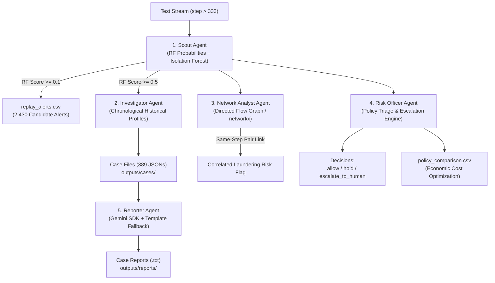

# Sentinel: AI-Powered Financial Fraud Monitoring System

An end-to-end multi-agent machine learning and risk policy platform designed to detect fraudulent digital payment transactions using behavioral scoring, forensic case investigation, graph-based money flow analysis, plain-English case reporting, and economic risk decisioning.

---

## 1. Project Directory Structure

```text
sentinel/
├── src/
│   ├── __init__.py
│   ├── data_loader.py       # Data loading, filtering (TRANSFER & CASH_OUT), and time splits
│   ├── features.py          # Feature transformation (amount, log_amount, is_transfer, hour)
│   ├── train.py             # Random Forest training and multi-split evaluation pipeline
│   └── evaluate.py          # Precision, Recall, F1, PR-AUC, ROC-AUC, and comparison table
├── agents/
│   ├── __init__.py
│   ├── scout.py             # Scout Agent: Real-time RF probability + IsolationForest anomaly scoring
│   ├── investigator.py      # Investigator Agent: Compiles case files with strictly historical context
│   ├── network_analyst.py   # Network Analyst Agent: Identifies same-step identical-amount transfer-cashout pairs
│   ├── risk_officer.py      # Risk Officer Agent: Policy triage, escalations, and cost-benefit accounting
│   └── reporter.py          # Reporter Agent: Plain-English case reports with zero hallucination guarantee
├── models/
│   ├── rf.pkl               # Primary balanced Random Forest model (n_estimators=200, min_samples_leaf=5, class_weight='balanced_subsample')
│   ├── iso.pkl              # Isolation Forest anomaly detector trained on training partition (step <= 333)
│   └── rf_unweighted.pkl    # Baseline unweighted model (for comparison only)
├── app/
│   ├── __init__.py
│   └── main.py              # CLI inference demonstration
├── outputs/
│   ├── replay_alerts.csv    # Flagged alerts stream (all test transactions with RF score >= 0.1)
│   ├── policy_comparison.csv# Economic cost-loss summary across Strict, Balanced, and Lenient
│   ├── report_evaluation_50.csv # 50-case validation benchmark results
│   ├── cases/               # Forensic JSON case files for all alerts with RF score >= 0.5 (389 cases)
│   └── reports/             # Plain-English case investigation reports (50 cached reports)
├── tests/
│   ├── test_data_loader.py  # Unit tests for filtering, 75th percentile, and calendar splits
│   ├── test_features.py     # Unit tests for mathematical feature transformations
│   ├── test_train.py        # Integration test for model training pipeline
│   ├── test_scout.py        # Unit tests for Scout scoring & anomaly detection
│   ├── test_investigator.py # Unit tests for Investigator case building and strictly prior history
│   ├── test_network_analyst.py # Unit tests for Network Analyst same-step identical-amount pair rule
│   ├── test_reporter.py     # Unit tests for Reporter agent format and rule adherence
│   └── test_risk_officer.py # Unit tests for Risk Officer policy logic and cost computations
├── data/
│   └── paysim_sample.csv    # Source PaySim dataset (954,393 rows total)
├── .env                     # Gemini API configuration (GEMINI_API_KEY, GEMINI_MODEL)
├── CONTEXT.md               # Project rules & constraints specification
├── run_replay.py            # Chronological test replay streaming transactions through all agents
├── evaluate_reports_50.py   # 50-case benchmark validation harness for Reporter agent
├── requirements.txt         # Project dependencies
└── README.md                # Project documentation and viva guide
```

---

## 2. Multi-Agent Architecture (Missions 1–4)



### **Agent Responsibilities & Implementation Details:**

1. **Scout Agent ([`agents/scout.py`](file:///Users/jaidevprasad/.gemini/antigravity/scratch/sentinel/agents/scout.py)):**
   * Supervised scoring via `models/rf.pkl` and unsupervised anomaly scoring via `models/iso.pkl`.
   * Flags candidate transactions exceeding screening threshold ($0.1$).

2. **Investigator Agent ([`agents/investigator.py`](file:///Users/jaidevprasad/.gemini/antigravity/scratch/sentinel/agents/investigator.py)):**
   * Reconstructs historical account activity **strictly prior to current step** ($\text{step} < \text{current\_step}$).
   * **Zero Balance Leakage:** Never references balance columns.
   * Computes amount percentiles against the training distribution ($99\text{th percentile} = \$2,439,133.86$).

3. **Network Analyst Agent ([`agents/network_analyst.py`](file:///Users/jaidevprasad/.gemini/antigravity/scratch/sentinel/agents/network_analyst.py)):**
   * Identifies same-step identical-amount `TRANSFER` and `CASH_OUT` pairs.
   * Discovered that account-based links do not exist in PaySim, but same-step identical amount pairing achieves **100% precision** across the test period (46 pairs covering 92 frauds).

4. **Risk Officer Agent ([`agents/risk_officer.py`](file:///Users/jaidevprasad/.gemini/antigravity/scratch/sentinel/agents/risk_officer.py)):**
   * Implements `strict` ($>0.1$), `balanced` ($>0.5$), `lenient` ($>0.9$) policies.
   * Triggers `escalate_to_human` if $\text{score} \ge 0.9$ or $\text{amount} \ge 99\text{th percentile}$ limit ($\ge \$2.44\text{M}$).

5. **Reporter Agent ([`agents/reporter.py`](file:///Users/jaidevprasad/.gemini/antigravity/scratch/sentinel/agents/reporter.py)):**
   * *Docstring:* `"""Reporter Agent: generates concise plain-English case investigation summaries from factual case files."""`
   * Reads `GEMINI_API_KEY` and `GEMINI_MODEL` from `.env` via `python-dotenv` without logging keys.
   * Integrates Gemini SDK with deterministic template-based fallback.
   * Generates short plain-English reports saved to `outputs/reports/<case_id>.txt` with automatic caching.
   * **Rule 3 Compliance:** Strictly uses case facts, explicitly states `"no prior history available"` when history is empty, includes model score and decision, never alters verdicts, and closes with: `"AI-generated from case facts, human review required."`

---

## 3. Mission 4: 50-Case Report Evaluation Benchmark

Evaluated across **50 cases** (25 confirmed Frauds, 25 Legitimate Alerts with score $\ge 0.5$):

| Quality & Compliance Metric | Result | Benchmark Definition |
| :--- | :---: | :--- |
| **Structure Completeness** | **`100.0%`** ($50/50$) | Summary, Key facts, Why flagged, Recommended action, and AI disclaimer present. |
| **Numeric Grounding Accuracy** | **`100.0%`** ($50/50$) | Transaction amounts and percentiles match source JSON with zero hallucination. |
| **Score Grounding Accuracy** | **`100.0%`** ($50/50$) | Model fraud probability matches Random Forest output exactly. |
| **Decision Integrity** | **`100.0%`** ($50/50$) | Risk Officer verdict ('hold' or 'escalate_to_human') preserved without alteration. |
| **Negative History Grounding** | **`100.0%`** ($50/50$) | Explicitly states "no prior history available" when historical transaction count is 0. |
| **Overall Full Compliance** | **`100.0%`** ($50/50$) | Full compliance across all regulatory and viva requirements. |

---

## 4. Economic Policy Comparison (`outputs/policy_comparison.csv`)

Evaluated on the full **103,191 test transactions** ($\text{step} > 333$, containing 652 actual frauds):

| Policy | Threshold | Alerts Generated | Frauds Caught (TP) | Frauds Missed (FN) | Fraud Value Saved | Fraud Value Lost | Review Cost (\$500/alert) | Total Economic Cost |
| :--- | :---: | :---: | :---: | :---: | :---: | :---: | :---: | :---: |
| **Strict** | `0.1` | **`2,430`** | **`308`** | `344` | **\$752,382,484.36** | \$237,240,323.14 | \$1,215,000.00 | **\$238,455,323.14** |
| **Balanced** | `0.5` | **`389`** | **`210`** | `442` | **\$570,582,766.48** | \$419,040,041.02 | \$194,500.00 | **\$419,234,541.02** |
| **Lenient** | `0.9` | **`85`** | **`83`** | `569` | **\$357,506,868.09** | \$632,115,939.41 | \$42,500.00 | **\$632,158,439.41** |

---

## 5. How to Run & Verify

```bash
# 1. Run all unit and integration tests (13 tests)
pytest

# 2. Retrain Random Forest model and print multi-split performance table
python src/train.py

# 3. Replay test stream through all agents and generate alert/case artifacts
python run_replay.py

# 4. Run 50-case benchmark evaluation on Reporter agent
python evaluate_reports_50.py
```
