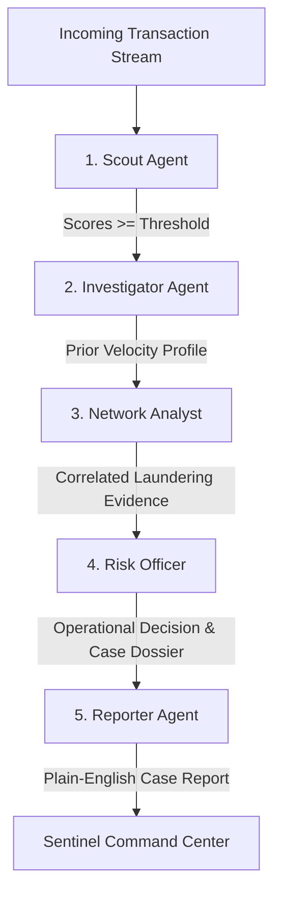

# Sentinel: AI Financial Fraud Monitoring & Defense Guide

Comprehensive technical reference and viva preparation guide for Sentinel, a multi-agent AI system for digital payment fraud monitoring.

---

## 1. Project Overview & Business Problem

- **Domain:** Real-time digital payment fraud monitoring (mobile money / wallet transfers).
- **Core Dataset:** PaySim synthetic financial dataset (15% uniform random sample: 954,393 transactions, 1,201 frauds).
- **Target Fraud Types:** Fraud occurs exclusively in `TRANSFER` and `CASH_OUT` transactions (415,562 combined transactions in the 15% sample).
- **Primary Objective:** Build an end-to-end, multi-agent AI fraud monitoring system with realistic feature engineering, zero data leakage, policy optimization, and plain-English case report synthesis.

---

## 2. Fundamental Architectural & Data Safeguards

### A. Zero Balance Data Leakage (Rule 1)
- **Omitted Columns:** `oldbalanceOrg`, `newbalanceOrig`, `oldbalanceDest`, `newbalanceDest`.
- **Reasoning:** In synthetic datasets like PaySim, balance differences often exhibit mathematical deterministic leakage (e.g. `newbalanceOrig == 0` for fraudulent transfers). In real-world production systems, balances are subject to batch ledger settlement, pending holds, and asynchronous clearing. Models trained on balance differences fail catastrophically in real-world deployment.
- **Sentinel Feature Set:**
  1. `amount`: Monetary transaction value.
  2. `log_amount`: Logarithm scale $\log(1 + \text{amount})$ compressing extreme values.
  3. `is_transfer`: Binary indicator ($1 = \text{TRANSFER}$, $0 = \text{CASH\_OUT}$).
  4. `hour`: Diurnal hour of the day ($\text{step} \pmod{24}$).

### B. Time-Based Splitting vs. Random Splitting (Rule 2)
- **Split Point:** 75th percentile of steps ($\text{step} \le 333$ for training, $\text{step} > 333$ for test evaluation).
- **Training Set:** 312,371 transactions (549 frauds).
- **Testing Set:** 103,191 transactions (652 frauds, base fraud rate: 0.63%).
- **Reasoning:** Random cross-validation leaks future fraud patterns into past predictions. A strict temporal split simulates real-time deployment where models are trained on historical records and evaluated on future unobserved transactions.

---

## 3. Modeling & Anomaly Detection

- **Primary Classifier:** `RandomForestClassifier` (200 trees, `min_samples_leaf=5`, `class_weight='balanced_subsample'`, `random_state=42`).
- **Anomaly Classifier:** `IsolationForest` (100 estimators, trained exclusively on normal/training transactions).
- **Performance Benchmarks (Test Period):**
  - **PR-AUC (Precision-Recall Area Under Curve):** `0.3371` (~53x lift over random baseline of 0.63%).
  - **ROC-AUC:** `0.7810`.

### Operating Threshold Trade-offs:

| Threshold | Operating Regime | Precision | Recall | F1-Score | Candidate Alerts |
|:---:|:---:|:---:|:---:|:---:|:---:|
| **0.10** | Strict (High Capture) | 12.67% | 47.24% | 0.1999 | 2,430 |
| **0.30** | Screening Mode | 28.14% | 38.50% | 0.3251 | 892 |
| **0.50** | Balanced (Optimal F1) | 53.98% | 32.21% | 0.4035 | 389 |
| **0.90** | Lenient (High Precision) | 97.65% | 12.73% | 0.2252 | 85 |

---

## 4. PaySim Network Crime Ring Discovery

- **Empirical Proof:** In PaySim, destination accounts of fraud transfers never reappear as origin accounts of cashouts ($0$ out of $606$ fraud transfer receivers appear as senders).
- **Forensic Network Rule:** Fraudsters execute simultaneous **same-step + identical-amount** `TRANSFER` $\rightarrow$ `CASH_OUT` pairs.
- **Dataset Findings:**
  - Entire 15% Sample: 93 correlated pairs (90 fraud-fraud, 3 legit-legit).
  - Test Period ($\text{step} > 333$): **46 correlated pairs, 100% fraud-fraud** (covers 92 test frauds).
- **Role in Sentinel:** Correlated pairs are embedded purely as contextual forensic evidence in case dossiers and network analysis; models and policy thresholds remain unmanipulated.

---

## 5. Multi-Agent System Architecture

1. **Scout (`agents/scout.py`):** Real-time screening using Random Forest and Isolation Forest scores.
2. **Investigator (`agents/investigator.py`):** Computes strict historical velocity profiles querying strictly earlier steps ($\text{step} < \text{current\_step}$).
3. **Network Analyst (`agents/network_analyst.py`):** Detects tandem same-step identical-amount money laundering pairs.
4. **Risk Officer (`agents/risk_officer.py`):** Evaluates candidate cases under Strict, Balanced, and Lenient risk policies with 99th percentile high-value checks.
5. **Reporter (`agents/reporter.py`):** Synthesizes structured plain-English reports (Summary, Key facts, Why flagged, Recommended action) using Google Gemini 1.5 with deterministic fallback. **The Reporter never makes or alters decisions.**

---

## 6. Macroeconomic Policy Simulation

Assumptions:
- **Manual Review Cost:** `500 currency units` per alert.
- **Missed Fraud Loss:** `100%` of stolen transaction principal.

| Policy Threshold | Alerts Generated | Review Cost | Missed Fraud Value | Net Total Cost |
|:---:|:---:|:---:|:---:|:---:|
| **Strict (0.10)** | 2,430 | 1,215,000.00 | 237,240,323.14 | **238,455,323.14** |
| **Balanced (0.50)** | 389 | 194,500.00 | 419,040,041.02 | **419,234,541.02** |
| **Lenient (0.90)** | 85 | 42,500.00 | 632,115,939.41 | **632,158,439.41** |

**Strategic Takeaway:** In large-value digital payment networks, **missed fraud losses dominate manual review costs by over two orders of magnitude**. The Strict policy delivers the lowest total net cost.

---

## 7. Regulatory Compliance & Governance

- **DPDP Act 2023 (India):** Strict data minimization (no balance or unnecessary PII processed) and purpose limitation.
- **RBI Cyber Security & Fraud Guidelines:** Dual-tier transaction monitoring, mandatory audit logging (`outputs/decisions.csv`), and human-in-the-loop governance.
